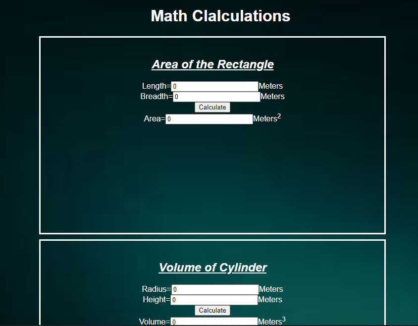

# AngularCalculation

# Web Page for Mathematical Calculations using Angular

## AIM:
To design a dynamic website to perform mathematical calculations using Angular Framwork

## DESIGN STEPS:

### Step 1:

Requirement collection.

### Step 2:

Creating the layout using HTML and CSS in component.html file

### Step 3:

Write typescript to perform the calculations.

### Step 4:

Validate the layout in various browsers.

### Step 5:

Validate the HTML code.

### Step 6:

Publish the website in the given URL.

## PROGRAM :

### app.component.html:
~~~
<h1>Math Clalculations</h1>
<Rectangle-Area></Rectangle-Area>
<Cylinder-Volume></Cylinder-Volume>
~~~

### index.html:
~~~
<!doctype html>
<html lang="en">
<head>
  <meta charset="utf-8">
  <title>Angularpj</title>
  <base href="/">
  <meta name="viewport" content="width=device-width, initial-scale=1">
  <link rel="icon" type="image/x-icon" href="favicon.ico">
  
</head>
<body>
  <app-root></app-root>
  
Developed by G Venkata Pavan Kumar

</body>
</html>

~~~
### cylinder.component.html:
~~~

    <h2><u>Volume of Cylinder</u></h2>
    Radius=<input [(ngModel)]="radius"type="text" >Meters 
    Height=<input [(ngModel)]="height"type="text" >Meters 
        <input type="button" (click)="onCalculate()" value="Calculate"> 
    Volume=<input type="text" [value]="volume">Meters3

~~~

### rectanagle.component.html:
~~~

    <h2><u>Area of the Rectangle</u></h2>
    Length=<input [(ngModel)]="length"type="text" >Meters 
    Breadth=<input [(ngModel)]="breadth"type="text" >Meters 
        <input type="button" (click)="onCalculate()" value="Calculate"> 
    Area=<input type="text" [value]="area">Meters2

~~~

### app.component.ts:
~~~
import { Component } from '@angular/core';

@Component({
  selector: 'app-root',
  templateUrl: './app.component.html',
  styleUrls: ['./app.component.css']
})
export class AppComponent {
  title = 'angularpj';
}

~~~
### cylinder.component.ts:
~~~
import { Component } from "@angular/core";

@Component({
    selector:"Cylinder-Volume",
    templateUrl:"./cylinder.component.html"
})
export class CylinderComponent{
    radius:number;
    height:number;
    volume:number;
    constructor(){
        this.radius=0;
        this.height=0;
        this.volume=this.radius*this.height
    }
    onCalculate()
    {
        this.volume=3.14*(this.radius*this.radius)*this.height;
    }
}

~~~
### rectangle.component.ts:
~~~
import { Component } from "@angular/core";

@Component({
    selector:"Rectangle-Area",
    templateUrl:"./rectangle.component.html"
})
export class RectagleComponent{
    length:number;
    breadth:number;
    area:number;
    constructor(){
        this.length=0;
        this.breadth=0;
        this.area=this.length*this.breadth
    }
    onCalculate()
    {
        this.area=this.length*this.breadth;
    }
}

~~~
## OUTPUT:

## Result:
Therefore we successfully designed a dynamic website to perform mathematical calculations using Angular Framwork.
